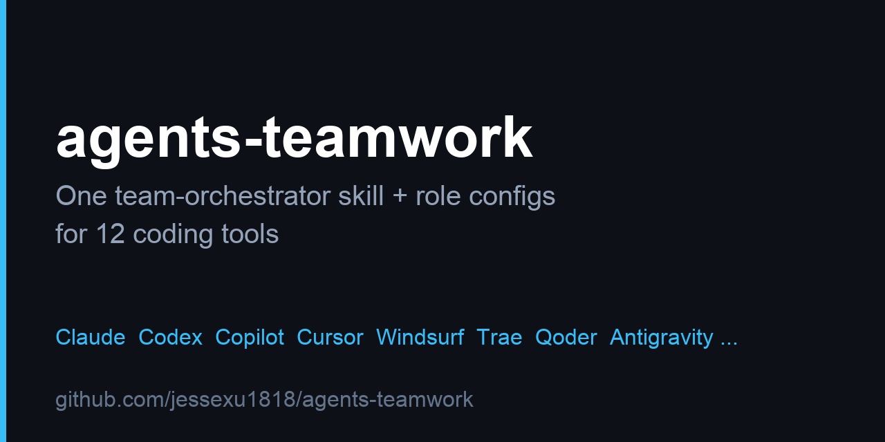

# agents-teamwork

[]() []() []() []()



Universal multi-IDE agent teamwork skills: one `team-orchestrator` skill plus
per-tool role configs that turn any supported IDE into a root-plus-specialists
team. The root owns architecture, decomposition, integration, verification, and
the final answer; subagents supply bounded evidence and execution only.

## Why

- One skill file works everywhere, even with zero generated config
  (skills-only mode).
- Generated role files prefill model, sandbox, and routing defaults per tool.
- Explicit delegation contracts keep parallel subagents from stepping on each
  other: one writer per file or subsystem, root mediates ownership.
- Category routing (`quick` / `deep` / `ultrabrain` / `visual`) scales cost to
  task difficulty.

## Topology

```text
                    team-orchestrator (root)
                    architect + integrator
        ____________________|____________________
        |        |         |         |           |
    explorer  worker    tester   reviewer   researcher   (core)
        |        |         |                        |
     planner  oracle   designer   ........ (optional extras)
     (.plans/  counsel  UI/vision
      interview)
```

The root delegates through bounded contracts (objective, scope, context,
constraints, deliverable, acceptance) and merges the returned slices. Never
claim delegation without a real subagent call.

## Quickstart

Three options, in order. Start with option 1.

### (1) Skills-only install — FIRST, 30 seconds, zero scripts

Copy the single skill file into your repo. That file alone is enough: the root
can play every role contract inline without generated configs.

```sh
cp templates/skills/team-orchestrator/SKILL.md <repo>/.agents/skills/team-orchestrator/SKILL.md
```

Per-tool skill destination (same file, different folder):

| Tool | Copy SKILL.md to |
| --- | --- |
| Claude | `<repo>/.claude/skills/team-orchestrator/SKILL.md` |
| Codex | `<repo>/.agents/skills/team-orchestrator/SKILL.md` |
| Cursor | `<repo>/.cursor/skills/team-orchestrator/SKILL.md` |
| opencode | `<repo>/.opencode/skills/team-orchestrator/SKILL.md` |
| Kiro | `<repo>/.kiro/skills/team-orchestrator/SKILL.md` |
| CodeBuddy | `<repo>/.codebuddy/skills/team-orchestrator/SKILL.md` |
| Generic agents | `<repo>/.agents/skills/team-orchestrator/SKILL.md` |
| Antigravity | `<repo>/.agents/skills/team-orchestrator/SKILL.md` |
| Copilot | `<repo>/.github/skills/team-orchestrator/SKILL.md` |
| Windsurf | `<repo>/.windsurf/skills/team-orchestrator/SKILL.md` |
| Qoder | `<repo>/.qoder/skills/team-orchestrator/SKILL.md` |
| Trae | `<repo>/.trae/skills/team-orchestrator/SKILL.md` |

Then invoke it:

```text
$team-orchestrator Map the auth flow under src/auth and list safe edit points. Change nothing.
```

See [guides/quickstart.md](guides/quickstart.md) for the 5-minute walkthrough.

### (2) Full install — generated roles + AGENTS.md

For model/sandbox defaults and per-role files, run the installer into an
existing target directory (it must differ from this source dir):

```sh
./setup.sh --target ../my-project --tools all --components all
```

Useful variants:

```sh
# Only the skill, via the installer (no role files, no AGENTS.md)
./setup.sh --target ../my-project --tools claude,agents --components skills-only --yes
# Add optional roles
./setup.sh --target ../my-project --components all --extra planner,oracle,designer --yes
# Cheaper preset, or pin one model
./setup.sh --target ../my-project --preset plus --yes
./setup.sh --target ../my-project --reviewer-model gpt-5 --reviewer-effort high --yes
```

`scripts/generate.py` accepts the same flags (plus `--preset pro|plus|custom`
and `--<role>-model` overrides); `setup.sh` is a safe wrapper that stages,
prompts on overwrite, then copies in. Windows: `setup.ps1` mirrors `setup.sh`.

### (3) Global install

Per-tool global install is manual in v1: `--global` is refused by the
installer. Follow [guides/global-setup.md](guides/global-setup.md) for the
per-tool user-directory paths and merge rules.

## Tools matrix

`--tools all` covers 12 tools. Skills land under each tool's `skills/` dir;
roles land under each tool's `agents/` dir (components `all` only).

| Tool | Skill output | Roles output |
| --- | --- | --- |
| claude | `.claude/skills/team-orchestrator/SKILL.md` | `.claude/agents/<role>.md` |
| codex | `.agents/skills/team-orchestrator/SKILL.md` | `.codex/agents/<role>.toml` + `.codex/config.toml` |
| cursor | `.cursor/skills/team-orchestrator/SKILL.md` | `.cursor/agents/<role>.md` |
| opencode | `.opencode/skills/team-orchestrator/SKILL.md` | `.opencode/agents/<role>.md` |
| kiro | `.kiro/skills/team-orchestrator/SKILL.md` | `.kiro/agents/<role>.md` |
| codebuddy | `.codebuddy/skills/team-orchestrator/SKILL.md` | `.codebuddy/agents/<role>.md` |
| agents | `.agents/skills/team-orchestrator/SKILL.md` | `.agents/agents/<role>.md` |
| antigravity | `.agents/skills/team-orchestrator/SKILL.md` | `.agent/agents/<role>.md` |
| copilot | `.github/skills/team-orchestrator/SKILL.md` | `.github/agents/<role>.agent.md` |
| windsurf | `.windsurf/skills/team-orchestrator/SKILL.md` | `.windsurf/rules/<role>.md` |
| qoder | `.qoder/skills/team-orchestrator/SKILL.md` | `.qoder/agents/<role>.md` |
| trae | `.trae/skills/team-orchestrator/SKILL.md` | `.trae/rules/<role>.md` |

Full installs also write `AGENTS.md` at the target root. Codex is the
exception: roles convert to TOML (`model`, `sandbox_mode`, raw numeric
`temperature`, `developer_instructions`); every other tool keeps Markdown with
the `model:` frontmatter field substituted. Per-tool notes live in
[guides/tools/](guides/tools/).

## Model config

Presets select per-role models; flags override them.

| Preset | Orchestrator | Reviewer | All other roles | Reviewer effort |
| --- | --- | --- | --- | --- |
| pro (default) | gpt-5 | gpt-5 | gpt-5-mini | low |
| plus | gpt-5-mini | gpt-5 | gpt-5-mini | low |
| custom | gpt-5-mini | gpt-5-mini | gpt-5-mini | low |

Per-role pins:

```sh
./setup.sh --target ../my-project --orchestrator-model gpt-5 --worker-model gpt-5-mini --yes
python3 scripts/generate.py --target /tmp/demo --tools claude --preset plus --reviewer-effort high
```

Category routing is chosen at invocation time, not install time:
`--category quick|deep|ultrabrain|visual`. See
[guides/model-matrix.md](guides/model-matrix.md) and
[guides/categories.md](guides/categories.md).

Precedence (highest wins):

```text
invocation flags (--orchestrator/--worker/--reviewer/--category/--extra)
  > per-role pins (--<role>-model, --reviewer-effort)
    > category routing (quick/deep/ultrabrain/visual)
      > preset defaults (pro/plus/custom)
```

## Roles

| Role | Focus | Required |
| --- | --- | --- |
| explorer | code mapping, flows, constraints | core |
| worker | scoped implementation (quick / deep) | core |
| tester | reproduction and targeted validation | core |
| reviewer | post-change independent audit | core |
| researcher | external and version-specific facts | core |
| planner | interview-style plan into `.plans/` | (optional) |
| oracle | pre-change architecture and debug counsel | (optional) |
| designer | UI structure plus image / PDF reading | (optional) |

Core roles install by default. Optional roles need `--extra`
(e.g. `--extra planner,oracle,designer`, any subset).

## Using the skill

Trigger `$team-orchestrator` when a task spans files, needs parallel
exploration, independent testing or review, version-specific external facts, or
the user asks for delegation or subagents. Skip it for trivial single-file
edits and simple questions.

```text
$team-orchestrator --category deep --extra Keep public API unchanged. \
  Refactor coupon validation under src/orders into a tested module.
```

Invocation parameters: `--orchestrator <model>`, `--worker <model>`,
`--reviewer <model>`, `--category <quick|deep|ultrabrain|visual>`,
`--extra <text>` (free-form constraint appended to every delegation contract).
Per-run flags win over generated files. Details: [guides/planning.md](guides/planning.md).

## Token and cost notes

- Skills-only mode costs nothing extra: no generated files, no pinned premium
  models.
- Default presets keep mapping, building, and checking on `gpt-5-mini`;
  `gpt-5` is reserved for the orchestrator and reviewer (pro) or the reviewer
  alone (plus).
- Reserve `ultrabrain` (oracle counsel + high-effort review) for the hardest
  reasoning; use `quick` for tight single-area fixes.
- Subagents return conclusions with paths, symbols, commands, and outcomes,
  not raw dumps; the root keeps context to decisions, digests, diffs, and
  risks.

## Guides

- [guides/quickstart.md](guides/quickstart.md) — 5-minute step-by-step
- [guides/model-matrix.md](guides/model-matrix.md) — presets, pins, routing, precedence
- [guides/categories.md](guides/categories.md) — quick/deep/ultrabrain/visual
- [guides/planning.md](guides/planning.md) — planner interview flow
- [guides/global-setup.md](guides/global-setup.md) — manual global install
- [guides/tools/](guides/tools/) — per-tool paths, model fields, limits

## Contributing and license

See [CONTRIBUTING.md](CONTRIBUTING.md), [CODE_OF_CONDUCT.md](CODE_OF_CONDUCT.md),
[SECURITY.md](SECURITY.md), and [LICENSE](LICENSE) (MIT).
